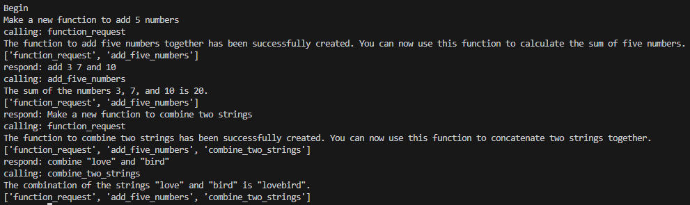
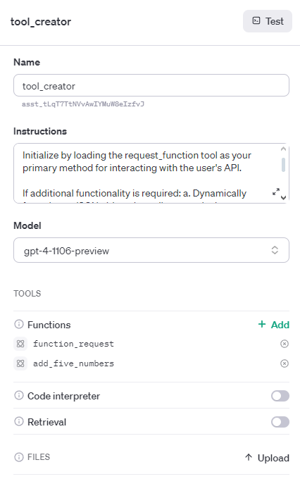
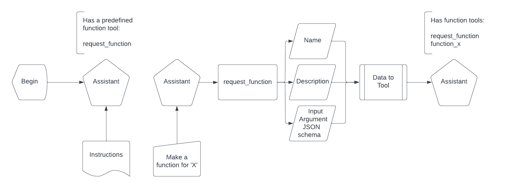

# Tool Maker

This preliminary experiment has to do with getting the OpenAI Assistant endpoint to create agents that can create tools (functions). The ability to instantiate any tool from scratch will be critical to enabling a fully autonomous swarm.

This function is as-yet undefined.

## Version 1

Ensure you have an OPENAI_API_KEY set following this guide: [OpenAI API Key Safety Best Practices](https://help.openai.com/en/articles/5112595-best-practices-for-api-key-safety)

Make sure you are in the root directory.
run the ```unit_manager.py``` file using the following command.
`<python_path> -m agents.tool_maker.unit_manager`.
Where you have inserted your correct python path, this will run the file as if it was part of a module with root location.

from agents.tool_maker.tool_manager import ToolManager
import os
import json
from pathlib import Path  # Import Path from pathlib
from agents.agent_builder.create import AgentBuilder

class AssistantManager:
    def __init__(self, client):
        self.client = client
        self.assistant = None
        self.agent_builder = AgentBuilder(client=self.client)
        self.base_path = Path(__file__).absolute().parent
        tools_path = os.path.join(self.base_path, "tool_creator_metadata.json")
        try:
            with open(tools_path, "r") as file:
                self.assistant_package = json.load(file)
        except FileNotFoundError:
            raise Exception("tool_creator_metadata.json not found in the expected directory.")

    def get_assistant(self, assistant_type="creator"):
        """Retrieve or create an assistant based on its description."""
        name = self.assistant_package.get(assistant_type, {}).get("name")
        if not name:
            raise ValueError(f"No name found for assistant type '{assistant_type}' in the metadata.")

        self.agent_builder.create_assistant(name)
        assistants = self.client.beta.assistants.list()
        assistant_names = [assistant.name for assistant in assistants]

        if name not in assistant_names:
            raise ValueError(f"{name} needs to be created using create.py in /agents/agent_builder/")

        assistant_dict = {assistant.name: assistant.id for assistant in assistants}
        assistant = self.client.beta.assistants.retrieve(assistant_id=assistant_dict[name])
        self.assistant = assistant
        return assistant

if __name__ == "__main__":
    from shared.openai_config import get_openai_client
    client = get_openai_client()
    assistant_manager = AssistantManager(client=client)
    assistant = assistant_manager.get_assistant()
    print(assistant)
from agents.tool_maker.tool_manager import ToolManager
import os
import json
from pathlib import Path  # Import Path from pathlib
from agents.agent_builder.create import AgentBuilder

class AssistantManager:
    def __init__(self, client):
        self.client = client
        self.assistant = None
        self.agent_builder = AgentBuilder(client=self.client)
        self.base_path = Path(__file__).absolute().parent
        tools_path = os.path.join(self.base_path, "tool_creator_metadata.json")
        try:
            with open(tools_path, "r") as file:
                self.assistant_package = json.load(file)
        except FileNotFoundError:
            raise Exception("tool_creator_metadata.json not found in the expected directory.")

    def get_assistant(self, assistant_type="creator"):
        """Retrieve or create an assistant based on the specified type."""
        name = self.assistant_package.get(assistant_type, {}).get("name")
        if not name:
            raise ValueError(f"No name found for assistant type '{assistant_type}' in the metadata.")

        self.agent_builder.create_assistant(name)
        assistants = self.client.beta.assistants.list()
        assistant_names = [assistant.name for assistant in assistants]

        if name not in assistant_names:
            raise ValueError(f"{name} needs to be created using create.py in /agents/agent_builder/")

        assistant_dict = {assistant.name: assistant.id for assistant in assistants}
        assistant = self.client.beta.assistants.retrieve(assistant_id=assistant_dict[name])
        self.assistant = assistant
        return assistant

if __name__ == "__main__":
    from shared.openai_config import get_openai_client
    client = get_openai_client()
    assistant_manager = AssistantManager(client=client)
    assistant = assistant_manager.get_assistant()
    print(assistant)
ou will be prompted to define a tool for creation. The assistant will then generate an OpenAI tool compatible JSON schema defining the name of the new function, it's description and the input argument schema. It will proceed to add this tool to the current assistant.
You will be prompted to define a tool for creation. The assistant will then generate an OpenAI tool compatible JSON schema defining the name of the new function, it's description and the input argument schema. It will proceed to add this tool to the current assistant.
You will be prompted to define a tool for creation. The assistant will then generate an OpenAI tool compatible JSON schema defining the name of the new function, it's description and the input argument schema. It will proceed to add this tool to the current assistant.

(Example)


(Update to assistant on OpenAI servers)



## Assistant Instructions

```
Instruction Set for Assistant-to-be-Tool_Creator:

Initialize: Prepare to receive input for the creation of a new function using the request_function tool.

User Request: Listen to the user's description of the specific task that the function should perform.

Function Name: a. Derived from the task description, formulate a concise and descriptive function name. b. Aim for clarity and specificity to convey the function's purpose effectively.

Function Description: a. Write a clear and precise description of the function's expected behavior. b. Include details about what the function will accomplish and any side effects. c. (Emphasize) Ensure that the description explicitly communicates the function's intended outcome to avoid ambiguity.

Input Arguments JSON Schema: a. Based on the requirements of the task, define the JSON schema for the input arguments. b. The schema should be comprehensive and must specify the types, required fields, and constraints for each input argument. c. Ensure that the schema aligns with the user's requirements and the function's intended behavior.

Validation: Cross-check the name, description, and JSON schema against the user's requirements to confirm accuracy and completeness.

Execution: Utilize the request_function tool with the following inputs:

name: [Function Name]

descriptions: [Function Description]

input_argument_json_schema: [Input Arguments JSON Schema]

Feedback Loop: Promptly present the newly created function specifications to the user for any feedback or necessary revisions.

Iterate: Make adjustments as requested by the user, refining the function name, description, and input argument schema until it meets the user's satisfaction.

Finalize: Once the user gives approval, consider the function creation process complete.

Note: Remember to prioritize user requirements and emphasize clear communication in the function description, as highlighted by the user.
```

## Flowchart

